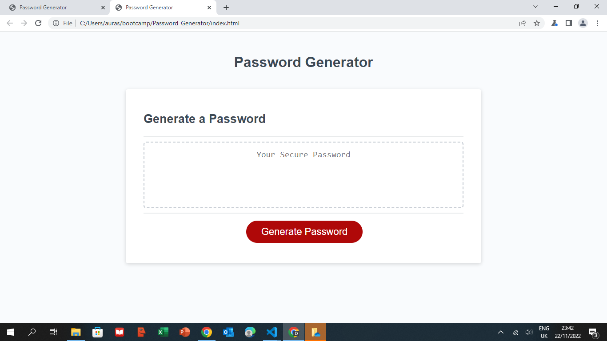

# Password_Generator

## Description

For this project, I created an application to generate a random password based on criteria the user selected by including only the types of characters he requested.  For the Javascript part, I've used a code based mostly on functions: to let the user choose his preferences, to create an array based on his choices, to generate a random number from that array, to display the password after the prompts when the button is clicked. I've used algorithms to work with returned values, global and local variables and also functions called from inside others. Code is validating each input and it will run only if some conditions are met.  This app will run in the browser, and will feature dynamically updated HTML and CSS powered by JavaScript code.

## Instalation
The deployed link can be opened in any browser.

https://auraely.github.io/Password_Generator/

## Usage

## Credits 

N/A

## Licence

MIT